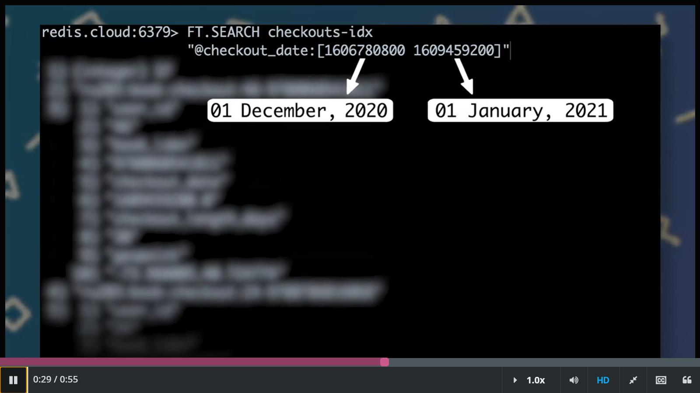
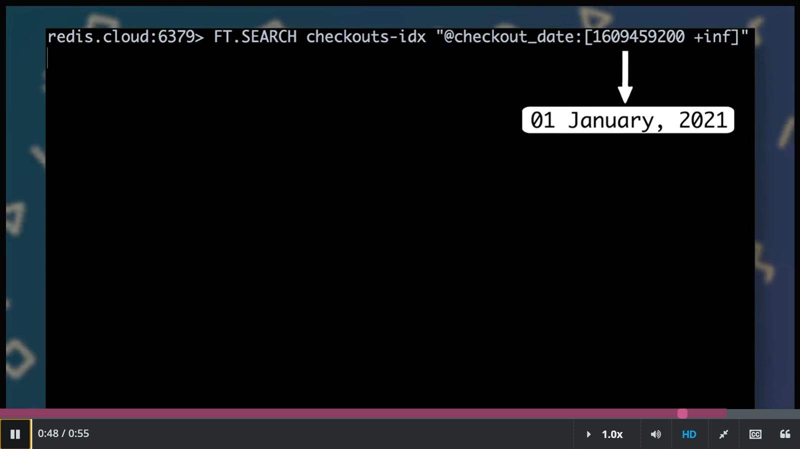

### Summary to RU203 


#### I. [Querying Structured Data](https://youtu.be/0mqpeQP2sbc)

Hello, and welcome to the first unit in our Redis Search course. We're excited to have you here and look forward to learning with you. In this unit, you're going to learn how to query structured data. For example, suppose our user records look like this. 
```
user = {
    "id": 1, 
    "email_address": "a@example.com", 
    "registration_date": "1611094374"
}
```

We might want to query users by ID or email address or by registration date. If you want to query your data in an unstructured manner, that falls within the realm of full text search which is the subject of the next unit. For now, we're going to focus on 

- Exact string matching
- Numeric queries
- Dates and times
- Boolean logic
- And more

We're really excited to have you here. Let's get started.

1. [Finding Exact String Matches](https://youtu.be/cRbPtrGtCsM)

If you know that you will only ever query a field for exact string matches, like IDs, categories, or email addresses, then the most efficient field type is `TAG`. To see an example of `TAG` fields, let's take a look at this definition of the index we use for book data. 
```
FT.CREATE books-idx 
ON HASH PREFIX 1 ru203:book:details: 
SCHEMA  isbn TAG SORTABLE 
        title TEXT WEIGHT 2.0 SORTABLE 
        subtitle TEXT SORTABLE thumbnail TAG NOINDEX 
        description TEXT SORTABLE 
        published_year NUMERIC SORTABLE 
        average_rating NUMERIC SORTABLE 
        authors TEXT SORTABLE 
        categories TAG SEPARATOR ";" 
        author_ids TAG SEPARATOR ";"
```

You can see that we've stored several fields as `TAG`s-- isbn, thumbnail, categories, and author IDs. Let's see what these values look like in the hash for Neal Stephenson's book, Cryptonomicon. 
```
> HMGET ru203:book:details:9780060512804 
        title isbn author_ids categories 
1) "Cryptonomicon"
2) "9780060512804"
3) "111"
4) "Fiction"
>
```

Here are the isbn categories and author ID values. We know that when we search for books by these fields, we're going to use an exact string match, so Tag is the right type for these fields. Now let's try some queries. 
```
> FT.SEARCH books-idx "@isbn:{9780393059168}"
1) "1"
2) "ru203:book:details:9780393059168"
3) 1) "authors"
   2) "Arthur Conan Doyle"
   3) "isbn"
   4) "9780393059168"
   5) "average_rating"
   6) "4.63"
   7) "categories"
   8) "Detective and mystery stories, English"
   9) "subtitle"
   10) "volume 2"
   11) "thumbnail"
   12) "http://books.google.com/books/content?id=beGfDAEACAAJ&printsec=frontcover&img=1&zoom=1&source=gbs_api"
   13) "description"
   14) "Collects Doyle's fifty-six classic short stories, arranged in the order in which they appeared in late nineteenth- and early twentieth-century book editions, in a set complemented by four novels, editor biographies of Doyle, Holmes, and Watson as well asl"
   15) "published_year"
   16) "2005"
   17) "author_ids"
   18) "1619"
   19) "title"
   20) "The New Annotated Sherlock Holmes"
>
```

This query finds the book, The New Annotated Sherlock Holmes, by its isbn. And this query searches for books by J. R. R. Tolkien, the author, with the ID 34. 
```
> FT.SEARCH books-idx "@author_ids:{34}"
1) "35"
2) "ru203:book:details:9780007149124"
3) 1) "authors"
   2) "John Ronald Reuel Tolkien"
   3) "isbn"
   4) "9780007149124"
   5) "average_rating"
   6) "4.08"
   7) "categories"
   8) "Fairy tales, English"
   9) "subtitle"
   10) ""
   11) "thumbnail"
   12) "http://books.google.com/books/content?id=Wla7NwAACAAJ&printsec=frontcover&img=1&zoom=1&source=gbs_api"
   13) "description"
   14) "Never before published in a single volume, Tolkien's four novellas (\"Farmer Giles of Ham, Leaf by Niggle, Smith of Wootton Major,\" and \"Roverandom\") and one book of poems (\"The Adventures of Tom Bombadil\") are gathered together in a fully illustrated set."
   15) "published_year"
   16) "2002"
   17) "author_ids"
   18) "34"
   19) "title"
   20) "Tales from the Perilous Realm"
4) "ru203:book:details:9780261102200"
5) 1) "authors"
   2) "John Ronald Reuel Tolkien;Christopher Tolkien"
   3) "isbn"
   4) "9780261102200"
   5) "average_rating"
   6) "4.16"
   7) "categories"
   8) "English fiction"
   9) "subtitle"
   10) "The History of the Lord of the Rings, Part Two"
   11) "thumbnail"
   12) "http://books.google.com/books/content?id=Hon4PwAACAAJ&printsec=frontcover&img=1&zoom=1&source=gbs_api"
   13) "description"
   14) "Fantasy-roman."
   15) "published_year"
   16) "2002"
   17) "author_ids"
   18) "34;936"
   19) "title"
   20) "The Treason of Isengard"
. . . 
>
```

Now, it's your turn to address some queries in our hands-on tutorial.

2. Field-Specific Searches

Let's review how to query a `TAG` field in RediSearch. There are two key points:

- Use the @ symbol before the field name
- Surround the search term with curly braces

For example, here's how we query the books index (called books-idx) for a specific ISBN value:
```
FT.SEARCH books-idx "@isbn:{9780393059168}"
```

This is an example of searching one field. When we talk about boolean logic and later about full-text search, you'll see examples of searching across multiple fields.

3. Escaping Punctuation

**A note on querying with punctuation:** To query for a tag that includes punctuation, like an email address, you need to escape the punctuation (the data in the underlying Hash does not need to be escaped). For example, if we had a tag for "j. r. r. tolkien" instead of author ID, to query it you would need to write **@authors:{j\\. r\\. r\\. tolkien}**.

As you can see, you escape punctuation by preceding it with two backslashes (\\).

So, as a general rule you, should always escape the following punctuation in TAG field queries:

**,.<>{}[]"':;!@#$%^&*()-+=~**

First, find the book *The Inner Reaches of Outer Space*:
```
FT.SEARCH books-idx "@isbn:{9781577312093}"
```

Now find the author Edward John Moreton Drax Plunkett Baron Dunsany, whose ID is 690:
```
FT.SEARCH authors-idx "@author_id:{690}"
```

Next, find books by Edward John Moreton Drax Plunkett Baron Dunsany:
```
FT.SEARCH books-idx "@author_ids:{690}" RETURN 1 title
```

**NOTE**: You can use the RETURN option to return only some fields.

Finally, find books that have the "Fantasy" category:
```
FT.SEARCH books-idx "@categories:{Fantasy}"
```

4. [Working with Numbers](https://youtu.be/grBk0_iz-BM)

If you need to query your data by numeric range, use the `NUMERIC` type. In our books index, we store the publication year and average rating as `NUMERIC` fields. You can see what that looks like here. This lets us issue range queries against the average rating and publication year field. Ranges require a start and end value. 
```
> FT.SEARCH books-idx "@published_year:[2018 2020]"
1) "8"
2) "ru203:book:details:9781406917895"
3) 1) "authors"
   2) "Hardpress"
   3) "isbn"
   4) "9781406917895"
   5) "average_rating"
   6) "3.72"
   7) "categories"
   8) "History"
   9) "subtitle"
   10) ""
   11) "thumbnail"
   12) "http://books.google.com/books/content?id=1q9_yAEACAAJ&printsec=frontcover&img=1&zoom=1&source=gbs_api"
   13) "description"
   14) "This is a reproduction of the original artefact. Generally these books are created from careful scans of the original. This allows us to preserve the book accurately and present it in the way the author intended. Since the original versions are generally quite old, there may occasionally be certain imperfections within these reproductions. We're happy to make these classics available again for future generations to enjoy!"
   15) "published_year"
   16) "2019"
   17) "author_ids"
   18) "3711"
   19) "title"
   20) "Israel's Shepherd; Or, Thoughts on the Love of God, Manifested in Christ Jesus. in a Series of Letters"
. . . 
>
```

For example, to query for books published between 2018 and 2020, you do this. 2018 is the lower bound, and 2020 is the upper bound on this numeric range. Ranges are inclusive by default. To make a value exclusive, you add a parenthesis like this. 
```
> FT.SEARCH books-idx "@published_year:[2005 (2010]"
1) "1873"
2) "ru203:book:details:9780425204191"
3) 1) "authors"
   2) "Clive Cussler"
   3) "isbn"
   4) "9780425204191"
   5) "average_rating"
   6) "3.89"
   7) "categories"
   8) "Fiction"
   9) "subtitle"
   10) ""
   11) "thumbnail"
   12) "http://books.google.com/books/content?id=Pay5bDWJCnAC&printsec=frontcover&img=1&zoom=1&source=gbs_api"
   13) "description"
   14) "When an enzyme capable of prolonging life is discovered deep beneath the North Atlantic, NUMA Special Assignments Team leader Kurt Austin and his colleague, Joe Zavala, investigate a killer who is targeting the enzyme's harvesters and researchers. Reprint."
   15) "published_year"
   16) "2005"
   17) "author_ids"
   18) "614"
   19) "title"
   20) "Lost City"
. . . 
>
```

You can use positive and negative infinity for unbounded values. For example, this query finds all books published since 2018, inclusive. 
```
> FT.SEARCH books-idx "@published_year:[2008 +inf]"
1) "68"
2) "ru203:book:details:9780552998086"
3) 1) "isbn"
   2) "9780552998086"
   3) "title"
   4) "THE HOTEL NEW HAMPSHIRE"
   5) "subtitle"
   6) ""
   7) "thumbnail"
   8) ""
   9) "description"
   10) ""
   11) "categories"
   12) ""
   13) "authors"
   14) "JOHN IRVING"
   15) "author_ids"
   16) "2252"
   17) "published_year"
   18) "2010"
   19) "average_rating"
   20) "3.83"
4) "ru203:book:details:9781844671083"
5) 1) "isbn"
   2) "9781844671083"
   3) "title"
   4) "In Defense of Lost Causes"
   5) "subtitle"
   6) ""
   7) "thumbnail"
   8) "http://books.google.com/books/content?id=VWB0QgAACAAJ&printsec=frontcover&img=1&zoom=1&source=gbs_api"
   9) "description"
   10) "A high-energy philosophical manifesto on the concept and virtues of universal values addresses such topics as Heidegger's engagement with the Third Reich, the role of class struggles in global capitalism, and the legacy of Christianity against New Age spiritualism. Original."
   11) "categories"
   12) "Philosophy"
   13) "authors"
   14) "Slavoj \xc5\xbdi\xc5\xbeek"
   15) "author_ids"
   16) "937"
   17) "published_year"
   18) "2008"
   19) "average_rating"
   20) "3.89"
. . . 
>
```

And this query gets all books published before 1925, inclusive. 
```
> FT.SEARCH books-idx "@published_year:[-inf 1925]"
1) "8"
2) "ru203:book:details:9780812234565"
3) 1) "authors"
   2) "Smith Palmer Bovie;David R. Slavitt"
   3) "isbn"
   4) "9780812234565"
   5) "average_rating"
   6) "3.83"
   7) "categories"
   8) "Greek drama (Comedy)"
   9) "subtitle"
   10) ""
   11) "thumbnail"
   12) "http://books.google.com/books/content?id=AaWiwwEACAAJ&printsec=frontcover&img=1&zoom=1&source=gbs_api"
   13) "description"
   14) ""
   15) "published_year"
   16) "1901"
   17) "author_ids"
   18) "3217;3218"
   19) "title"
   20) "Aristophanes: The Acharnians"
. . . 
>
```

Now go ahead and try some range queries on your own. Try finding the titles of books with an average rating from 4.5 through 5:
```
FT.SEARCH books-idx "@average_rating:[4.5 5]" RETURN 1 title
```

Now find the titles of books with an average rating from 0 through 1:
```
FT.SEARCH books-idx "@average_rating:[0 1]" RETURN 1 title
```

Next, find the titles of books having an average rating of at least 4 and being published on or after 2015:
```
FT.SEARCH books-idx "@average_rating:[4 +inf] @published_year:[2015 +inf]" RETURN 1 title
```

Finally, find the titles of books with an average rating of at most 3 published before 2000:
```
FT.SEARCH books-idx "@average_rating:[-inf 3] @published_year:[-inf (2000]" RETURN 1 title
```

5. [Working with Dates and Times](https://youtu.be/TuWdvZNEsmI)

To work with dates and times in RediSearch, you store them as Unix timestamps in a numeric field. As an example, we'll look at the checkout_date field in our book checkouts index. 
```
FT.CREATE checkouts-idx 
ON HASH PREFIX 1 ru203:book:checkout: 
SCHEMA  user_id TAG SORTABLE 
        book_isbn TAG SORTABLE 
        checkout_date NUMERIC SORTABLE 
        return_date NUMERIC SORTABLE 
        checkout_period_days NUMERIC SORTABLE 
        geopoint GEO
```

Here's what that index looks like. You can see that checkout_date is a `NUMERIC` field. And here's what a checkout_date stored as a Unix timestamp looks like in a checkout record. 
```
> HGET ru203:book:checkout:11-9780393059168 checkout_date 
"1606464000.0"
> 
```

Now let's try some queries. First, let's find book checkouts between December 1, 2020, and January 1, 2021. Both dates are inclusive. 


This timestamp represents 12 AM UTC on December 1. And this one represents 12 AM UTC on January 1. You can also specify unbounded ranges with positive and negative infinity. For example, finding every book checked out since January 1, 2021, looks like this. 


Now try running a few date queries in this lesson's hands-on.

Try finding users who have logged in on or after 1:25pm UTC on December 11, 2020:
```
FT.SEARCH users-idx "@last_login:[1607693100 +inf]"
```

Now try to find users whose last login was prior to 1:25pm UTC on December 11, 2020:
```
FT.SEARCH users-idx "@last_login:[-inf (1607693100]"
```

You'll have to use a tool like the [UnixTimestampConverter](http://www.unixtimestampconverter.com/) to get the correct timestamp.

6. [Boolean Logic](https://youtu.be/lH8m4bBVg-k)

You can use Boolean logic to express complex queries. Let's look at a few examples. 
```
> FT.SEARCH books-idx "wizards castles"
1) "7"
2) "ru203:book:details:9780739423851"
3) 1) "authors"
   2) "Diana Wynne Jones"
   3) "isbn"
   4) "9780739423851"
   5) "average_rating"
   6) "4.44"
   7) "categories"
   8) "Fantasy"
   9) "subtitle"
   10) ""
   11) "thumbnail"
   12) "http://books.google.com/books/content?id=hB7hAAAAMAAJ&printsec=frontcover&img=1&zoom=1&source=gbs_api"
   13) "description"
   14) "Howl's moving castle - Eldest of three sisters, in a land where it is considered to be a misfortune, Sophie is resigned to her fate as a hat shop apprentice until a witch turns her into an old woman and she finds herself in the castle of the greatly feared Wizard Howl. Castle in the air - Having long indulged himself in daydreams more exciting than his mundane life as a carpet merchant, Abdullah unexpectedly purchases a magic carpet and his life changes dramatically as his daydreams come true and"
   15) "published_year"
   16) "2002"
   17) "author_ids"
   18) "40"
   19) "title"
   20) "Wizard's Castle"
. . . 
>
```

Including more than one term implies a Boolean `AND`. So you'd find books about both wizards and castles like this. You can specify a Boolean `OR` with a pipe symbol. 
```
> FT.SEARCH books-idx "dogs|cats"
1) "122"
2) "ru203:book:details:9780752853697"
3) 1) "authors"
   2) "Terry Pratchett;Gray Jolliffe"
   3) "isbn"
   4) "9780752853697"
   5) "average_rating"
   6) "3.83"
   7) "categories"
   8) "Cats"
   9) "subtitle"
   10) "A Campaign for Real Cats"
   11) "thumbnail"
   12) "http://books.google.com/books/content?id=Gb8aHQAACAAJ&printsec=frontcover&img=1&zoom=1&source=gbs_api"
   13) "description"
   14) "The Unadulterated Cat is becoming an endangered species as more and more of us settle for those boring mass-produced cats the ad-men sell us - the pussies that purr into their gold-plated food bowls on the telly. But the Campaign for Real Cats sets out to change all that by helping us to recognise a true, unadulterated cat when we see one. For example: real cats have ears that look like they've been trimmed with pinking shears; real cats never wear flea collars . . . or appear on Christmas cards . . . or chase anything with a bell in it; real cats do eat quiche. And giblets. And butter. And anything else left on the table, if they think they can get away with it. Real cats can hear a fridge door opening two rooms away . . ."
   15) "published_year"
   16) "2002"
   17) "author_ids"
   18) "84;2833"
   19) "title"
   20) "The Unadulterated Cat"
. . .
>
```

Here's how you find books that are either about dogs or about cats. And if you really don't like cats, you can use the dash symbol for Boolean `NOT`. 
```
> FT.SEARCH books-idx "dogs -cats"
1) "70"
2) "ru203:book:details:9780439294843"
3) 1) "authors"
   2) "Gordon Korman"
   3) "isbn"
   4) "9780439294843"
   5) "average_rating"
   6) "3.71"
   7) "categories"
   8) "Drama"
   9) "subtitle"
   10) ""
   11) "thumbnail"
   12) "http://books.google.com/books/content?id=8A1lfv8ETv4C&printsec=frontcover&img=1&zoom=1&source=gbs_api"
   13) "description"
   14) "For use in schools and libraries only. Truthful Wallace gives a thumbs-down to a book much to the chagrin of his English teacher, who sentences him to help with a stage version of the book. Wallace is unaware that his plot-improvement suggestions will wind up changing the entire production."
   15) "published_year"
   16) "2001"
   17) "author_ids"
   18) "1809"
   19) "title"
   20) "No More Dead Dogs"
. . . 
>
```

This query gets rid of those [pesky](https://dictionary.cambridge.org/dictionary/english-chinese-traditional/pesky) [felines](https://dictionary.cambridge.org/dictionary/english-chinese-traditional/feline?q=felines). Now you practice issuing some queries with Boolean logic in them. Notice how the syntax changes depending on the type of field you're querying.

7. Full-Text Search

Many of the queries in this section use full-text search because this type of query makes boolean logic simple to illustrate.

Queries that don’t use a specific field default to full-text search using all `TEXT` fields. So, consider again the following query, taken from the last video:
```
FT.SEARCH books-idx "dogs|cats"
```

This query searches for dogs OR cats in all `TEXT` fields in the index.

For now, don’t worry about exactly how full-text search works. Focus on the boolean logic, and we’ll tell you all about full-text search in the next section.

8. Combining Multiple Fields

You can also use boolean logic to combine terms from multiple fields.

Here, we use a boolean AND to find books with the author “rowling” that have “goblet” in the title.
```
FT.SEARCH books-idx "@authors:rowling @title:goblet"
```

Just like when you use a boolean OR for terms in a single field, you connect two fields with a boolean OR by joining them with a pipe. In this query, we find books by the author “rowling” or that have “potter” in the title.
```
FT.SEARCH books-idx "@authors:rowling | @title:potter"
```

And same as with searching for terms in a field, use the dash symbol for a NOT query between fields. In this query, I'm looking for books by Tolkien whose titles do not include the word "ring".
```
FT.SEARCH books-idx "@authors:tolkien -@title:ring"
```

Try getting Stephen King books published between 1980 and 1990, inclusive.
```
FT.SEARCH books-idx "@authors:'Stephen King' @published_year:[1980 1990]"
```

Now try finding books with the Philosophy category, published on or before 1975, written by anyone other than Arthur Koestler.
```
FT.SEARCH books-idx "@categories:{Philosophy} @published_year:[-inf 1975] -@authors:'Arthur Koestler'"
```

**Note**: We use curly braces around “Philosophy” in this query because “categories” is a TAG field. As you may recall from our section on exact-string matches, querying TAG fields requires curly braces.

Finally, try finding books written by Aruthur Koestler OR Michel Foucault:
```
FT.SEARCH books-idx "@authors:'Arthur Koestler' | @authors:'Michel Foucault'"
```

9. [Sorting Results](https://youtu.be/UpCUKPbCn3U)

To sort query results, you first need a `SORTABLE` field in the index. Here's an example from our books index. As you can see, several fields in this index are sortable. This index lets us sort by the title, publication year, average rating and more. Once you have a sortable field, you can sort results by adding this SORTBY option to your query. Here, I'm looking for history books published since 1980, inclusive. I want the results sorted by year of publication, ascending. Now it's your turn to try sorting a few queries in our hands on.

10. Descending Sort

Here's the same query from the video you just watched, but this time with results sorted in descending order:
```
FT.SEARCH books-idx "@published_year:[2018 +inf]" SORTBY published_year DESC
```

11. Sorting by Multiple Fields

The `SORTBY` option to `FT.SEARCH` allows you to sort by only one field per query. However, as you’ll see when we talk about aggregations, you can sort an aggregation query by more than one field.

Try finding Juvenile Fiction books sorted by the year they were published:
```
FT.SEARCH books-idx "@categories:{Juvenile Fiction}" SORTBY published_year
```

Now try finding books with an average rating between 4.9 and 5 inclusive, sorted by average rating in descending order:
```
FT.SEARCH books-idx "@average_rating:[4.9 5]" SORTBY average_rating DESC
```

12. [Limiting Results](https://youtu.be/pK5uWyqgcAo)

Let's look at one last feature of basic queries-- how to limit the result set. Use the `LIMIT` option to limit the number of results returned by a query. This option takes two arguments, an offset and a maximum number of results to return in that order. Here, we query for the five highest rated books published in 1955. As you can see, the offset is 0-based. Next up, you'll try a few `LIMIT` queries. Then, you'll tackle some challenges to reinforce what you've learned in this unit. Good luck.

13. Pagination

You can use `LIMIT` for pagination. To get the first five Agatha Christie books ordered by publication date, you might write this:
```
FT.SEARCH books-idx "@authors:Agatha Christie" SORTBY published_year LIMIT 0 5
```

And to get the next five Agatha Christie books, you could write this:
```
FT.SEARCH books-idx "@authors:Agatha Christie" SORTBY published_year LIMIT 5 5
```

Try searching for books written by Ursula K. Le Guin, ordered by publication year, and limiting the query to the first 3 books published.
```
FT.SEARCH books-idx "@authors:Ursula K. Le Guin" SORTBY "published_year" LIMIT 0 3
```

Next, try some offset and limit pagination. Starting at offset 100, get the next 100 books from the Fiction category published on or after the year 2000.
```
FT.SEARCH books-idx "@published_year:[2000 +inf]" LIMIT 100 100
```


#### II. [Full-Text Search](https://youtu.be/be10fjWAsUg)

We started this course by talking about how to search for structured data, like finding users by ID or email address. This second unit is about searching unstructured data using full-text search. When you perform a full-text search, you may not know the exact value you want to find and the fields you're searching may contain unstructured data, like product descriptions or user reviews. 

In the following lessons, you're going to learn how to perform basic full-text searches, prefix matches, and Boolean queries. You'll also learn a bit about stemming, which is one of the techniques that makes full-text search possible. Let's dive right in.

1. [Basic Full-Text Search](https://youtu.be/5XLvPmVVH4E)

In this lesson, you learned how to use RediSearch to perform basic full-text searches. Full text search is most useful when you don't know the exact value you want to find or you're searching unstructured data. We're going to try a few queries using our books index. Here's what that index looks like again. 

You can see that we've indexed the title, subtitle, and description fields as `TEXT`. This query searches for the terms "Hercule" and "Poirot" in all the text fields in the book's index. So if the words "Hercule" or "Poirot" appear in any `TEXT` field, we'll have a match. Now go ahead and try a few basic full text searches on your own.

2. Stemming

When you index a field as `TEXT`, RediSearch stores the root of the word in the index, not the word itself. So the word “thinking” becomes “think,” “running” becomes “run,” and so on. This is known as stemming.

Here’s an example of how this works. I search for books that have the word “running” in the title.
```
FT.SEARCH books-idx "@title:running" RETURN 1 title
```

And I get back books with the words “Running” and “Run” in the title.
```
127.0.0.1:6379> FT.SEARCH books-idx "@title:running" RETURN 1 title
 1) (integer) 14
 2) "ru203:book:details:9780679722946"
 3) 1) "title"
    2) "Running Dog"
 4) "ru203:book:details:9780451197962"
 5) 1) "title"
    2) "The Running Man"
 6) "ru203:book:details:9780385315289"
 7) 1) "title"
    2) "Running from Safety"
 8) "ru203:book:details:9780345461612"
 9) 1) "title"
    2) "Running from the Deity"
10) "ru203:book:details:9780330281720"
11) 1) "title"
    2) "Running in the Family"
12) "ru203:book:details:9781400033829"
13) 1) "title"
    2) "Who Will Run the Frog Hospital?"
14) "ru203:book:details:9780590317672"
15) 1) "title"
    2) "Run"
16) "ru203:book:details:9780439650366"
```

Full-text search works by comparing terms in the input against all `TEXT` fields in the index. Try searching for books using the name of a popular author of spy novels, John Le Carre.
```
FT.SEARCH books-idx "John Le Carre"
```

Queries also compare your terms against descriptions. Try searching for unicorns with this query:
```
FT.SEARCH books-idx unicorns
```

Notice that the results have “unicorn” in their descriptions.

3. [Prefix Matching](https://youtu.be/OHUbm0_3yIg)

RediSearch supports prefix matching. You can provide the first characters of a term, and RediSearch finds documents with any terms that start with those characters. This feature allows you to provide search results as users type. 

For example, here we search for documents containing terms that start with 'wiz.' Be careful, though. The fewer characters you include in a prefix search, the more terms you'll search. With a very large index and a short enough prefix, your queries might be slow. OK, that was a quick overview of prefix matching. Now, it's time to practice a few queries yourself.

You can combine a normal full-text term with a prefix term. Try searching for matches with the term “atwood” and the prefix “hand”:
```
FT.SEARCH books-idx "atwood hand*"
```

You can also use multiple prefix terms in a single query. Try searching for “agat* orie*” -- you should find *Murder on the Orient Express*.
```
FT.SEARCH books-idx "agat* orie*"
```

4. [Boolean logic, field-specific searches, sorting, and limiting](https://youtu.be/NTGGBQnOqVY)

All the techniques we talked about in unit one of this course for Boolean logic, field-specific searches, sorting, and limiting also work for full-text searches. Let's look at an example that uses a couple of these techniques. In this query, we're looking for all book records that mention wizard, but not Harry. And we're sorting the results by title. Now, you'll get a chance to practice using Boolean logic and other techniques with full-text search yourself.

Try finding books about dragons that are not also about wizards or magicians!
```
FT.SEARCH books-idx "dragons -wizard -magician"
```

Now, try a full-text search for “mars” across all `TEXT` fields with a full-text search for “heinlein” in only the authors field:
```
FT.SEARCH books-idx "mars @authors:heinlein"
```

Try sorting all books that mention the prefix “crypto” sorted by publication year.
```
FT.SEARCH books-idx crypto* sortby published_year
```

Finally, get the first book in order of publication year that mentions “murder”:
```
FT.SEARCH books-idx murder sortby published_year limit 0 1
```

5. [Highlighting and Summarization](https://youtu.be/6M_2QD1jEwI)

When you perform a full-text search, you'll often want to highlight the text and the result that matches the search terms. That's what highlighting is for. When you request highlighting, RediSearch, will surround matching terms and results with an HTML tag. 

For example, here's how you search for nature and highlight any matches found in a description, title, or subtitle fields. You can see in this example that RediSearch highlighted nature in the title and description of this book. 

Next, you'll learn about summarization. And then you'll get a chance to try some queries for yourself. After this lesson, you'll have finished your section on full-text search. You'll get to practice what you've learned by taking a few challenges. Remember to refer back to these videos or ask questions in our online chat for guidance. Best of luck! :)

6. Summarization

Summarizing refers to the practice of returning small snippets of text around terms that matched a query, rather than the entire field.

This query returns a maximum of three (which is also the default) "fragments" of twenty-five words each for matches of the term "agamemnon":
```
FT.SEARCH books-idx agamemnon SUMMARIZE FIELDS 1 description FRAGS 3 LEN 25
```

**Note**: In this context, the matching text is often called a “hit.”

Result:
```
1) (integer) 6
 2) "ru203:book:details:9780812216271"
 3)  1) "description"
     2) "David Slavitt of the great trilogy of the House of Atreus, telling of
         Agamemnon's murder at the hands of his wife, Clytemnestra, and her 
         lover... "
     3) "categories"
     4) "Drama"
     5) "thumbnail"
     6) "http://books.google.com/books/content?id=z22kI-IKUXoC&printsec=
         frontcover&img=1&zoom=1&edge=curl&source=gbs_api"
     7) "subtitle"
     8) "The Oresteia (Agamemnon, The Libation Bearers, The Eumenides)"
     9) "title"
    10) "Aeschylus, 1"
    11) "isbn"
    12) "9780812216271"
    13) "average_rating"
    14) "4.01"
    15) "authors"
    16) "Aeschylus"
    17) "published_year"
    18) "1998"
    19) "author_ids"
    20) "538"
...
```

You can combine **HIGHLIGHT** and **SUMMARIZE** together to highlight hits in a field and summarize the text returned around each hit.
```
FT.SEARCH books-idx agamemnon SUMMARIZE FIELDS 1 description FRAGS 3 LEN 25 HIGHLIGHT
```

Result:
```
 1) (integer) 6
 2) "ru203:book:details:9780812216271"
 3)  1) "description"
     2) "David Slavitt of the great trilogy of the House of Atreus, telling of
        <b>Agamemnon</b>'s murder at the hands of his wife, Clytemnestra, and 
        her lover... "
     3) "categories"
     4) "Drama"
     5) "thumbnail"
     6) "http://books.google.com/books/content?id=z22kI-IKUXoC&
        printsec=frontcover&img=1&zoom=1&edge=curl&source=gbs_api"
     7) "subtitle"
     8) "The Oresteia (Agamemnon, The Libation Bearers, The Eumenides)"
     9) "title"
    10) "Aeschylus, 1"
    11) "isbn"
    12) "9780812216271"
    13) "average_rating"
    14) "4.01"
    15) "authors"
    16) "Aeschylus"
    17) "published_year"
    18) "1998"
    19) "author_ids"
    20) "538"
...
```

Search for the term “illusion” and highlight any matches:
```
FT.SEARCH books-idx illusion highlight
```

Now search for “shield,” highlighting any matches, and summarizing the description field with a max fragments of 1 and length 20.
```
FT.SEARCH books-idx shield HIGHLIGHT SUMMARIZE FIELDS 1 description FRAGS 1 LEN 20
```


#### III. [Aggregations](https://youtu.be/P9xU4RKE0vg)

Now that you've learned how to work with structured and unstructured data, we're going to talk about aggregations. You might already be familiar with this topic from relational databases and SQL. But if not, aggregations let you process the results of a query and transform them. So how is this type of query useful? Mainly you'll use aggregations to create analytics reports or build faceted search experiences. 

When you build reports, you often need to group query results by a specific field and calculate a number based on data in the field. You might also sort the results or transform the field value somehow, like by turning a Unix timestamp into a date string. We'll cover all these features of aggregations in this section. And you'll also get a chance to try some queries yourself. Let's get started.

1. [Counting Query Results](https://youtu.be/vGEXCfKmWiU)

A common use of aggregations in relational databases is to find a number of records that match a query without returning the results. With SQL, you do this with SELECT COUNT. With RediSearch, you can use the `LIMIT` option to the `FT.SEARCH` command for this. If you specify `LIMIT` 0 0, RediSearch will return the number of documents that match your query, but not the results. 

For example, if you want to return the number of books that mention Tolkien, but not the actual results you can do so like this. Next, you'll learn another way to count query results, this time using aggregations. And then you'll practice a few queries yourself.

2. Counting Query Results with Aggregations

`FT.SEARCH` works perfectly well to count query results, but you can also use the `FT.AGGREGATE` command to count items in a query.

Here’s an aggregation query that finds the same number of items as the `FT.SEARCH` query we just looked at:
```
FT.AGGREGATE books-idx * GROUPBY 0 REDUCE COUNT 0 AS total
```

This query introduces us to most of the concepts we’ll talk about in this unit. Let’s go through the steps briefly.

First: FT.AGGREGATE books-idx *

`FT.AGGREGATE` is the command you use to run RediSearch aggregations. Like `FT.SEARCH`, it takes an index and a query. Here we use the star symbol to query all items in the index.

Second: GROUPBY 0

Aggregations require a GROUPBY clause to reduce results down to a number using a “reducer” function.

Finally: REDUCE COUNT 0 AS total

Here, we use the COUNT reducer to count all items in the group, and we name the result “total.”

Try finding the number of books in the books-idx index with the category “Fiction.” Remember that the “categories” field is a TAG field.
```
FT.SEARCH books-idx "@categories:{Fiction}" LIMIT 0 0
```

3. [Grouping Data](https://youtu.be/dPL0sXjCKZU)

Another common use of aggregations is to group results. You do that in Redisearch with the GROUPBY option to the `FT.AGGREGATE` command. Here, we get all the years in which someone published a book that mentioned Tolkien. Now it's your turn to practice grouping by fields.

4. Aggregating All Items in a Query

Sometimes, you’ll want to run an aggregation on all documents that match a query. For example, say you want to run a calculation against all books that mention Tolkien. Here’s how you’d group them all together:
```
FT.AGGREGATE books-idx tolkien GROUPBY 0
```

Notice the **GROUPBY 0** option. This places all query results in the same group, so if you add a reducer function -- which we'll talk about in the next lesson -- you can apply it to all items in the query.

Try grouping book checkouts in the checkouts-idx index by the checkout date.
```
FT.AGGREGATE checkouts-idx * GROUPBY 1 @checkout_date
```

Now try a search for “python” in the books-idx index grouped by the “categories” field.
```
FT.AGGREGATE books-idx python GROUPBY 1 @categories
```

5. [Sorting](https://youtu.be/o1NawK5KrJA)

You can sort aggregate query results with the `SORTBY` option. This works the same as sorting a non-aggregate query. This query finds the years that someone published a book mentioning Tolkien, sorted by the publication year. Now you try sorting a few aggregate queries.

Try finding all users in the users-idx index, grouped by last login date and last name, and then sorted by last name.
```
FT.AGGREGATE users-idx * GROUPBY 2 @last_login @last_name SORTBY 1 @last_name
```

Now try finding books in the books-idx index published in the year 1983, grouped by author and title, and then sorted by authors and by title.
```
FT.AGGREGATE books-idx "@published_year:[1983 1983]" GROUPBY 2 @authors @title SORTBY 2 @authors @title
```

6. [Reducing Aggregation Data](https://youtu.be/9YrKDkBFObE)

The point of aggregate queries is usually to calculate some number, like an average or a sum. With RediSearch, you do this with a reducer function. Say you want to count the number of books published each year that mention Tolkien, sorted by year. That query looks like this. The `COUNT` reducer counts the number of records in a group. Next, you'll get a chance to try using reducer functions yourself.

Try counting the number of books in each category to see which categories have the most books.
```
FT.AGGREGATE books-idx * GROUPBY 1 @categories REDUCE COUNT 0 AS books_count SORTBY 2 @books_count DESC
```

Now try finding the average rating of all books that mention “tolkien.”
```
FT.AGGREGATE books-idx tolkien GROUPBY 0 REDUCE AVG 1 @average_rating as avg_rating
```

7. [Transforming Aggregation Data](https://youtu.be/OaJnQ-Fe-BI)

You can use `APPLY` to transform values in the index like converting Unix timestamps to human readable date strings. This query counts the number of book checkouts on each date, but instead of returning Unix time stamps, it returns formatted date strings. 

Notice the `timefmt` function here. This converts a timestamp to a date string. Next, you'll see another example of how to use `APPLY` to transform data, and you'll practice a few queries of your own. Then you'll move on to the next section of this course, which will teach you about advanced topics like partial indexes and how to handle spelling errors and queries. Stick around to learn some of RediSearch's deeper mysteries.

Try finding all books with two co-authors. Authors are stored in a `TEXT` field, with coauthors separated by semicolons, so one way to do this is to use the `split()` function in an `APPLY` step to split the authors. At the end, you’ll need a [FILTER expression](https://redis.io/docs/stack/search/reference/aggregations/#filter-expressions) to match only books with two authors.
```
FT.AGGREGATE books-idx * APPLY "split(@authors, ';')" AS authors_list GROUPBY 1 @title REDUCE COUNT_DISTINCT 1 authors_list AS authors_count FILTER "@authors_count==2"
```

Now try counting the number of user logins (according to the “last_login” field in the users-idx index) per day of the week. The return should be a day of the week, like 0 for Sunday, 1 for Monday, etc., and the total logins on that day of the week. Check the [list of APPLY functions](https://redis.io/docs/stack/search/reference/aggregations/#list-of-field-apply-functions).
```
FT.AGGREGATE users-idx * GROUPBY 2 @last_login @user_id APPLY "dayofweek(@last_login)" AS day_of_week GROUPBY 1 @day_of_week REDUCE COUNT 0 AS login_count SORTBY 1 @day_of_week
```

Finally, find the days that more than one user logged in -- in other words, count the distinct IDs of users in the users-idx index who last logged in, grouped by date. You should return the date as a formatted time string, like "2020-12-12T00:00:00Z".

Keep in mind that the field “last_login” is a time -- and you want to find the date. Hint: you’ll need to use two `APPLY` expressions. Be sure to check the list of `APPLY` functions. And also check out the supported [GROUPBY reducers](https://redis.io/docs/stack/search/reference/aggregations/#groupby-reducers).
```
FT.AGGREGATE users-idx * GROUPBY 2 @last_login @user_id APPLY "day(@last_login)" as last_login_day APPLY "timefmt(@last_login_day)" AS "last_login_str" GROUPBY 1 "@last_login_str" REDUCE COUNT_DISTINCT 1 "@user_id" AS num_logins FILTER "@num_logins>1"
```


#### IV. [Advanced Topics](https://youtu.be/k5_q9PBFEmc)

By now you learned how to work with structured and unstructured data. You also know how to use aggregations to build reporting queries like you can with SQL. Now it's time to dig into some advanced topics. We'll talk about how to create partial indexes, which can improve performance if you have a lot of hashes. 

We'll also look at how to do query-time boosting, which is a common feature of search engines. And we'll cover edge cases, like exact matching punctuation in text fields and how to handle spelling errors in queries. You might not use these techniques very often, but when the need arises, you'll be glad you learned them.

1. [Partial Indexes](https://youtu.be/3LVe51FLDIA)

When you create an index in RediSearch, you can specify the hashes of the index based on the data the hashes contain. These indexes work like partial indexes in relational databases. If you wanted to create an index on checkouts of a specific book, you could use to `FT.CREATE` command with a `FILTER` like this. Now you can query only checkouts of this book.

2. Why Do This?

So, why would you create a partial index? The best reason is to save memory.

When you're running Redis on a single server, all of your data, including any RediSearch indexes, needs to fit into RAM. On a cluster, the data needs to fit into the RAM of multiple servers. In both cases, you need to be conscious of memory use.

With partial indexes, you can index only the parts of the data that matter for querying. Consider these scenarios when partial indexes may be appropriate:

- Your index tracks automation events for a retail building, and there is one event type like "door opened" that repeats thousands of times

- Your index tracks ecommerce web site orders with a "status" field -- once the "status" is complete, your application doesn't care about the orders anymore

Imagine that the books-idx index had grown extremely large, and you wanted to split it based on the published year of books. Try creating two indexes: one for books published before 1990 and one for books published on or after 1990.
```
FT.CREATE books-older-idx ON HASH PREFIX 1 ru203:book:details: FILTER "@published_year<1990" SCHEMA isbn TAG SORTABLE title TEXT WEIGHT 2.0 SORTABLE subtitle TEXT SORTABLE thumbnail TAG NOINDEX description TEXT SORTABLE published_year NUMERIC SORTABLE average_rating NUMERIC SORTABLE authors TEXT SORTABLE categories TAG SEPARATOR ";" author_ids TAG SEPARATOR ";"
```

```
FT.CREATE books-newer-idx ON HASH PREFIX 1 ru203:book:details: FILTER "@published_year>=1990" SCHEMA isbn TAG SORTABLE title TEXT WEIGHT 2.0 SORTABLE subtitle TEXT SORTABLE thumbnail TAG NOINDEX description TEXT SORTABLE published_year NUMERIC SORTABLE average_rating NUMERIC SORTABLE authors TEXT SORTABLE categories TAG SEPARATOR ";" author_ids TAG SEPARATOR ";"
```

Once these indexes exist, try running a couple of queries. For example, get the count of the number of books in each index:
```
FT.SEARCH books-older-idx * LIMIT 0 0

FT.SEARCH books-newer-idx * LIMIT 0 0
```

Now try creating an index just for books with the “Fiction” category. Note that when filtering during `FT.CREATE`, you are filtering on the string values in a Hash.
```
FT.CREATE books-fiction-idx ON HASH PREFIX 1 ru203:book:details: FILTER "@categories=='Fiction'" SCHEMA isbn TAG SORTABLE title TEXT WEIGHT 2.0 SORTABLE subtitle TEXT SORTABLE thumbnail TAG NOINDEX description TEXT SORTABLE published_year NUMERIC SORTABLE average_rating NUMERIC SORTABLE authors TEXT SORTABLE categories TAG SEPARATOR ";" author_ids TAG SEPARATOR ";"
```

Now try using an aggregate query to find the authors with the most books published in the books-fiction-idx index.
```
FT.AGGREGATE books-fiction-idx * GROUPBY 1 @authors REDUCE COUNT_DISTINCT 1 @title as total_books SORTBY 2 @total_books DESC
```

3. [Adjusting the Score of a Term](https://youtu.be/EuHkkpH1-94)

Query-time boosting is a common technique in search engines. Boosting or modifying the score of specific terms in a query allows you to change document scores without re-indexing. With RediSearch, you can do this by changing the `weight` of a term. This full-text search for Greek mythology boosts the score of books that have an average rating of 4.5 or higher. 

Let's break this query down a bit more. The query is two clauses, one clause for Greek mythology books with an average rating of 4.5 or higher, and a second clause for all Greek mythology books. Because this query connects both terms with the Boolean `OR`, the two sets of results are combined. Changing the weight of the books that have an average rating of 4.5 or higher, like we do here, means they will score higher in the results.

Consider this scenario. A user browsing a bookstore's web site clicks on the “History” section and then searches for “greek” books. How might you increase the weight of “greek” books that have the “History” category, while also returning books from other categories?
```
FT.SEARCH books-idx "((@categories:{History}) => { $weight: 10 } greek) | greek"
```

This works because of the use of `OR` binary logic: books that mention “greek” and have the “History” category will score highest, followed by books of any category that mention “greek."

Another common boost is to score recent documents in an index higher. How might you use the same technique we used for Greek books to score “cowboy” books higher if they were published after the year 2000?
```
FT.SEARCH books-idx "((@published_year:[2000 +inf]) => { $weight: 10 } cowboy) | cowboy"
```

4. [Getting All Documents in an Index](https://youtu.be/WzGKJZ0ysx4)

Wild card queries return all documents in an index. This can be useful when writing aggregations or testing and debugging non-aggregation queries. Take a look at this query that finds all books in books index.

Try getting all users in the users-idx index.
```
FT.SEARCH users-idx *
```

5. Exact-Matching Punctuation

If the values in a `TEXT` field will contain punctuation and you want to be able to search for exact matches using that punctuation (e.g., email addresses), you'll need to escape any punctuation in the values when you index. And then when you query, you also need to escape punctuation.

As an example, the users-idx index stores email addresses as `TEXT` fields. When we added the email address that we planned to use as a `TEXT` field, we escaped all the punctuation, like so:
```
HMSET ru203:user:details:28 first_name "Kelvin" last_name "Brown" email "k.brown@example.com" escaped_email "k\\.brown\\@example\\.com" user_id "28"
```

To query this field later for an exact-match on an email address, we also need to escape any punctuation in the query:
```
FT.SEARCH users-idx "@escaped_email:k\\.brown\\@example\\.com"
```

If you want to find exact-matches on punctuation, the punctuation you need to escape when indexing and querying is:

**,.<>{}[]"':;!@#$%^&*()-+=~**

Try adding a new user and including their email address in the escaped_email field. The users-idx index processes this field as `TEXT`, which means you need to escape punctuation in the Hash *and* when you query.
```
HMSET ru203:user:details:1000 first_name "Andrew" last_name "Brookins" escaped_email "a\\.m\\.brookins\\@example\\.com" user_id "1000"
```

Now query the field -- note that you have to escape the punctuation in the email address again:
```
FT.SEARCH users-idx "@escaped_email:a\\.m\\.brookins\\@example\\.com"
```

6. [Handling Spelling Errors](https://youtu.be/GqlZzQFi5nI)

Congratulations, you've made it to the last lesson of the course. You've come a long way and your efforts should be commended. We've saved the best topic for last: spelling errors. You can use fuzzy matching also known as Levenshtein distance to transparently handle some spelling errors in a query. This query searches for terms similar to the word address misspelled with one d. You can see that Redis search finds matches for the correct spelling of the word.

7. Spellcheck

An alternative approach to handling spelling errors is to use the `FT.SPELLCHECK` command to return possible correct spellings when you suspect a spelling error.

You might use this when you find zero hits for a user’s query to suggest alternative words the user could try searching for. Or, without asking the user, you could run a second query using the first of the words returned by `FT.SPELLCHECK`, return the results, and explain that you corrected the user's spelling. The second approach is how most web search engines work.

The following spellcheck query finds all possible correct spellings of the term “wizrds” (notice that it is “wizards” misspelled):
```
FT.SPELLCHECK books-idx wizrds
```

Try searching for spell-check suggestions for the term “monter.”
```
FT.SPELLCHECK books-idx monter
```

Now try running a fuzzy-matching query to search for documents with similar terms to “monter.”
```
FT.SEARCH books-idx "%monter%"
```


### EOF (2024/09/06) 
